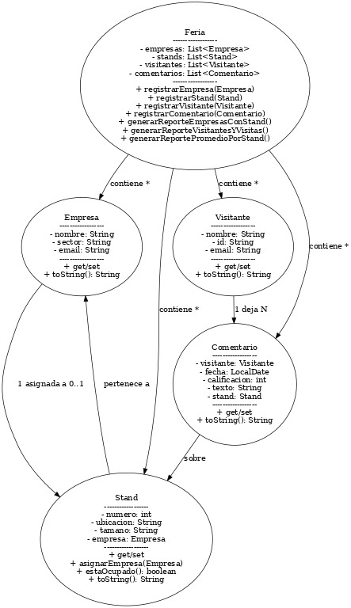

# Feria Empresarial

Aplicación en Java que simula la gestión de una feria empresarial, permitiendo registrar empresas, stands, visitantes y gestionar interacciones entre ellos.

## 📌 Objetivo General
Desarrollar una aplicación en Java que permita:
- Registrar empresas, stands y visitantes.
- Asignar stands a empresas.
- Permitir que visitantes dejen comentarios y calificaciones.
- Generar reportes de participación y calificaciones.

## 🚀 Funcionalidades
- **Registro de Empresas**: nombre, sector y correo electrónico.
- **Gestión de Stands**: número, ubicación, tamaño y empresa asignada.
- **Registro de Visitantes**: nombre, documento e email.
- **Interacción Empresa–Visitante**:
    - Registro de visitas.
    - Comentarios y calificaciones.
- **Reportes**:
    1. Empresas con sus stands asignados.
    2. Visitantes y stands visitados.
    3. Calificación promedio por stand.

## 🛠 Requisitos Técnicos
- **Lenguaje:** Java 8 o superior.
- **IDE recomendado:** IntelliJ IDEA, Eclipse o NetBeans.
- **Control de versiones:** Git y GitHub.
- **Documentación**:
    - Código comentado.
    - Diagrama UML en formato imagen o PDF.

## 📂 Estructura del Proyecto
src/
├── app/
│ └── Main.java
├── modelo/
│ ├── Empresa.java
│ ├── Stand.java
│ ├── Visitante.java
│ └── Comentario.java
└── servicio/
└── Feria.java
## 🖼 Diagrama UML


## ▶ Ejecución
1. Clonar el repositorio:
   ```bash
   git clone https://github.com/srodrigueztorres/FeriaEmpresarialEAN
2. Abrir el proyecto en tu IDE Java preferido.

3. Ejecutar la clase Main.java ubicada en el paquete app.

4. Usar el menú interactivo para registrar y consultar datos.

✍ Autor
- Soed Alejandra Rodriguez Torres

📅 Estado del Proyecto
En desarrollo – versión inicial funcional.